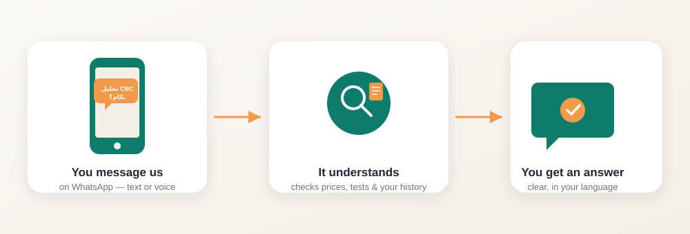

# IDH Medical Assistant

**A WhatsApp assistant that answers medical questions instantly — in Arabic
or English, by text or voice.**

Ask it how much a blood test costs, what to do before a scan, which branch
is nearest to you, or what a lab report actually means — and it answers
right there in the chat, day or night.

<p align="center">
  
</p>

<p align="center">
  ▶️ <a href="https://drive.google.com/file/d/1BQQiv_3Yi_vv-QbRm7UesidToW5O2oeY/view?usp=drive_link"><strong>Watch the 3-minute demo</strong></a>
</p>

### What it can do

- 💬 **Answer questions in plain conversation** — test prices, prep
  instructions, disease info, branch locations and hours — in Arabic or
  English, whichever the person writes in.
- 🎙️ **Understand voice notes**, not just typed text.
- 📄 **Read an uploaded lab report** (a photo or a PDF) and explain it in
  plain language.
- 🧠 **Remember who it's talking to** — name, and any conditions they've
  mentioned — so it doesn't ask the same questions twice.
- 🚨 **Recognize a real emergency** and respond appropriately instead of
  trying to answer it like a normal question.
- 📲 Runs natively inside **WhatsApp**, where people already are — no app
  to download.

---

## For developers

Everything below this point is the technical documentation: system
architecture, the request/orchestration flow in detail, and a step-by-step
guide to get the project running locally.

---

## 1. Table of contents

- [IDH Medical Assistant](#idh-medical-assistant)
    - [What it can do](#what-it-can-do)
  - [For developers](#for-developers)
  - [1. Table of contents](#1-table-of-contents)
  - [2. High-level architecture](#2-high-level-architecture)
  - [3. Project structure](#3-project-structure)
  - [4. Orchestration \& flow (how a message becomes an answer)](#4-orchestration--flow-how-a-message-becomes-an-answer)
    - [Step 1 — Session disarm / re-arm (`SessionManager`)](#step-1--session-disarm--re-arm-sessionmanager)
    - [Step 2 — Language gate](#step-2--language-gate)
    - [Step 3 — Voice / document branch](#step-3--voice--document-branch)
    - [Step 4 — Onboarding gate (text path)](#step-4--onboarding-gate-text-path)
    - [Step 5 — Router (LLM intent classification)](#step-5--router-llm-intent-classification)
    - [Step 6 — Intent handlers](#step-6--intent-handlers)
    - [Step 7 — RAG pipeline (`needs_retrieval`)](#step-7--rag-pipeline-needs_retrieval)
    - [Step 8 — Persist \& re-arm](#step-8--persist--re-arm)
    - [WhatsApp-specific wrapping](#whatsapp-specific-wrapping)
  - [5. The building blocks (services)](#5-the-building-blocks-services)
  - [6. Data stores](#6-data-stores)
  - [7. ⚠️ Security notice (read before you touch `.env`)](#7-️-security-notice-read-before-you-touch-env)
  - [8. Prerequisites](#8-prerequisites)
  - [9. Step-by-step setup](#9-step-by-step-setup)
    - [Sanity-check the boot log](#sanity-check-the-boot-log)
  - [10. Configuration reference](#10-configuration-reference)
  - [11. Running the service](#11-running-the-service)
  - [12. API reference](#12-api-reference)
  - [13. WhatsApp webhook setup](#13-whatsapp-webhook-setup)
  - [14. Testing](#14-testing)
  - [15. Known limitations \& scaling notes](#15-known-limitations--scaling-notes)
  - [16. Troubleshooting](#16-troubleshooting)

---

## 2. High-level architecture

The service is **not** a multi-agent framework — it's a single FastAPI app
with one central orchestrator (`ChatService`) that routes every inbound
message through a fixed pipeline of **gates** and **LLM chains**, each
backed by its own prompt template and, where needed, its own tools
(vector search, structured-fact storage, file parsing, speech-to-text).

```
                 ┌───────────────────────────────────────────┐
                 │              Entry points                 │
                 │  POST /api/chat/{,voice,document}          │
                 │  POST /webhook  (WhatsApp Cloud API)        │
                 └───────────────────┬───────────────────────┘
                                     ▼
                 ┌───────────────────────────────────────────┐
                 │        ChatService.handle_incoming_message │
                 │              (single orchestrator)          │
                 └───────────────────┬───────────────────────┘
                                     ▼
        ┌──────────────┐   ┌──────────────────┐   ┌──────────────────────┐
        │ Language gate│──▶│ Onboarding gate    │──▶│ Router (LLM, intent) │
        └──────────────┘   └──────────────────┘   └──────────┬───────────┘
                                                               ▼
        ┌────────────┬──────────────┬───────────────┬────────────────────┐
        │ emergency  │ out_of_scope │ chitchat       │ memory_recall       │
        │ (static)   │ (static)     │ (LLM chain)    │ (mem0 + LLM chain)  │
        └────────────┴──────────────┴───────────────┴────────────────────┘
                                                               │
                                                     needs_retrieval
                                                               ▼
                                        ┌──────────────────────────────────┐
                                        │ Multi-query hybrid RAG            │
                                        │ (Weaviate + BGE-M3 + RRF fusion)  │
                                        │ + long-term user context (mem0)   │
                                        │ → answer LLM chain                │
                                        └──────────────────────────────────┘
```

Separate from the text path, two more entry paths funnel into the *same*
orchestrator:

- **Voice** → ElevenLabs STT transcribes the audio → falls through to the
  text path above.
- **Medical report upload (PDF/image)** → LlamaCloud parses it → a
  dedicated `MedicalReportService` chain explains it (with an
  identity-matching check so a stranger's report isn't explained as if it
  were the requester's own).

Every LLM call is a plain [LangChain](https://python.langchain.com/)
`ChatPromptTemplate | ChatModel | StrOutputParser` chain hitting **Groq**
(fast open-weight inference) as the primary model, with a second
**OpenRouter**-backed model reserved specifically for medical-report
explanation.

---

## 3. Project structure

```
app/
  main.py                     FastAPI app factory + lifespan (builds every
                               singleton service exactly once at startup)
  core/
    config.py                 pydantic-settings — every env var, one place
    logging.py                 structlog setup (JSON logs)
  services/
    llm.py                     ChatGroq / ChatOpenAI(OpenRouter) factories + retry policy
    prompts.py                  every prompt template + static copy (AR/EN)
    retrieval.py                 BGE-M3 embeddings + Weaviate hybrid search + RRF fusion
    memory.py                     mem0 long-term profile/disease memory + validators
    onboarding.py                  name / birth_date / national_id capture + validation gate
    language_store.py               per-conversation language preference (not persisted)
    menu_store.py                    per-conversation menu-state tracker (see §15)
    session_manager.py                30s/90s nudge → close inactivity tracker (asyncio)
    history_store.py                   per-user chat_history between HTTP requests
    dedup.py                            WhatsApp message-id dedup (webhook retries)
    speech.py                            ElevenLabs speech-to-text
    documents.py                          LlamaCloud PDF/image → markdown parsing
    medical_report.py                      report explanation + patient-identity matching
    chat_service.py                          orchestrator: gates → router → intent handlers
    whatsapp_client.py                        WhatsApp Cloud API send/receive/media/signature
  schemas/
    chat.py                     Pydantic request/response models
  api/
    routes_chat.py               POST /api/chat, /voice, /document, profile endpoints
    routes_whatsapp.py            GET/POST /webhook (Meta verification + inbound events)
    routes_health.py               GET /healthz
    deps.py                         FastAPI DI (get_chat_service, verify_api_key, ...)
scripts/
  ingest.py                   CSV → Weaviate ingestion (builds the knowledge base)
tests/                        validator + onboarding-gate unit tests, health smoke test
_env.example / .env.example   environment variable template
pyproject.toml                dependencies (managed with uv)
uv.lock                       locked dependency versions
```

---

## 4. Orchestration & flow (how a message becomes an answer)

Everything funnels through **`ChatService.handle_incoming_message()`**
(`app/services/chat_service.py`). It accepts exactly one of `question`,
`audio_path`, or `document_path`, plus the caller's `chat_history` list and
`user_id`. The gates below run in this exact order, every time:

### Step 1 — Session disarm / re-arm (`SessionManager`)
The moment a message arrives, any pending "are you there?" nudge or
auto-close timer for that user is cancelled (`disarm`). After the bot
replies, the timer is re-armed (`arm`) unless the reply is itself a
conversation-ending message (emergency handoff, session-timeout notice).
Default: nudge after 60s of silence, close (and wipe `chat_history`) after
90s.

### Step 2 — Language gate
Every conversation must start by resolving Arabic vs. English, **before**
onboarding or routing runs.
- No language set yet, first message → send the language-choice prompt
  (buttons on WhatsApp, plain text elsewhere) and stop.
- No language set, but a `chat_history` already exists → this message
  *is* the answer to that prompt; parse it (`ar`/`en`/`1`/`2`/etc.),
  store it in `LanguagePreferenceStore` (in-memory, per `user_id`, cleared
  when the session times out), and immediately send either the onboarding
  request or the service menu — never small talk.
- Language already resolved → fall through.

### Step 3 — Voice / document branch
- `audio_path` set → `SpeechService.transcribe_audio()` (ElevenLabs) turns
  it into `question` text, then execution **falls through to the normal
  text path** below — voice is just a text message with an extra decoding
  step.
- `document_path` set → its own branch, parallel to text:
  1. Re-run the onboarding gate (a report still requires an identified
     user).
  2. `DocumentService.parse_medical_document()` (LlamaCloud, "agentic"
     parsing tier, good at reading lab-value tables) → markdown text,
     truncated to ~12k characters.
  3. `MedicalReportService.explain_medical_report()`:
     - Extracts the *patient identity* stated in the report itself
       (name/age/gender) via a dedicated LLM chain.
     - Compares it against the requester's own stored profile
       (`match_report_to_profile`) → `"own"` / `"other"` / `"unknown"`.
     - Only injects the requester's own known facts (name/age/diseases)
       into the explanation prompt, and only folds new disease mentions
       back into long-term memory, when the match is `"own"` — a stranger's
       report is explained without assuming it's the requester's data.
  4. Reply is saved to short-term history and the session timer is
     re-armed; return.

### Step 4 — Onboarding gate (text path)
If `user_id` is present, `OnboardingService.run_onboarding_gate()` checks
whether `name`, `birth_date`, and `national_id` are all on file
(`MemoryService.missing_profile_fields`). If any are missing:
- An extraction chain pulls whatever fields the *current* message
  contains (a user can supply several at once, in any order, over several
  turns).
- Each field is validated as it lands: national ID = exactly 14 digits,
  not all zero; birth date = parseable, not in the future, implies a
  realistic age (0–120) — `age` is **always derived** from `birth_date`,
  never asked for directly.
- Valid fields are written immediately to mem0 (`MemoryService.save_fact`)
  so progress isn't lost between turns.
- If something is missing or invalid, a follow-up question (or a
  validation-error message) is generated and returned — routing never
  runs until the profile is complete.
- Once complete, an inline disease-extraction chain
  (`remember_diseases_from_message`) opportunistically pulls any
  self-reported conditions out of the same message and appends them to
  the profile's `diseases` list.

### Step 5 — Router (LLM intent classification)
`ChatService.route_question()` sends the message + short-term history to
`ROUTER_PROMPT`, which must return strict JSON:
```json
{"standalone_question": "...", "intent": "emergency|memory_recall|chitchat|needs_retrieval|out_of_scope"}
```
`standalone_question` resolves pronouns/ellipsis against the chat history
(e.g. "and how much is that?" → "how much is a CBC test?") so downstream
retrieval always searches on a self-contained query. If the model's output
isn't valid JSON, the router fails safe to `needs_retrieval` with the
original question untouched.

### Step 6 — Intent handlers
| Intent | Handler | Behavior |
|---|---|---|
| `emergency` | static, per-language message | No memory read/write — an acute message is never folded into the standing profile. Ends the chat (session timer not re-armed). |
| `out_of_scope` | static, per-language message | e.g. "write me Python code" — politely declines. |
| `chitchat` | `CHITCHAT_PROMPT` chain | Small talk / greetings, with the user's mem0 context injected for personalization. |
| `memory_recall` | `MEMORY_RECALL_PROMPT` chain | "What did I tell you about my allergies?" style questions — answered strictly from stored mem0 facts. |
| `needs_retrieval` | RAG pipeline (below) | Anything requiring IDH-specific knowledge: tests, prices, prep steps, disease info, branch details. |

### Step 7 — RAG pipeline (`needs_retrieval`)
`RetrievalService.multi_query_hybrid_retrieve()`:
1. An LLM chain expands the standalone question into 3 alternative search
   queries (`QUERY_GENERATION_PROMPT`).
2. Each query runs as a **hybrid** search against Weaviate (dense vector
   from BGE-M3 + BM25 keyword, blended by `hybrid_alpha`).
3. Results from all 3 queries are combined with **Reciprocal Rank Fusion**
   and truncated to `retrieval_final_k`.
4. `format_context()` turns the fused chunks into a labeled context block.
5. `ANSWER_PROMPT` is invoked with `{language, question, context,
   chat_history, user_context_block}` → final answer.

An `ambiguous_field()` heuristic is available to detect when the top
results disagree on *which* specific branch/test/disease is meant (useful
for triggering a clarifying question instead of guessing) — see §15 for its
current wiring status.

### Step 8 — Persist & re-arm
The turn (`question`, `answer`) is appended to `chat_history` (capped at
`SHORT_TERM_MAX_MESSAGES`, default 5) and written back via
`ChatHistoryStore`. The session timer is re-armed unless the reply was an
emergency handoff or an explicit "your data was deleted" confirmation.

### WhatsApp-specific wrapping
`routes_whatsapp.py` sits *outside* this pipeline and only handles
transport concerns:
- Meta's webhook signature/GET-verification handshake.
- Deduplicating retried webhook deliveries by `wamid` (`MessageDedup`).
- Mapping WhatsApp payload types (`text`, `audio`, `image`, `document`,
  `interactive`) onto `handle_incoming_message()`'s three inputs — an
  `interactive` button/list tap is fed through as if the user had typed
  its `id` (e.g. `"ar"`, `"1"`).
- Choosing the outbound format: the language-choice message goes out as
  WhatsApp reply buttons, the service menu as a WhatsApp list message,
  everything else as plain text (`_send_reply`).
- Every inbound webhook is ack'd with `200` immediately; the actual
  reply is generated and sent from a `BackgroundTasks` job, since Meta
  retries aggressively on slow/non-200 responses.

---

## 5. The building blocks (services)

| Service | Responsibility | Backing tech |
|---|---|---|
| `ChatService` | Orchestrator — see §4 | LangChain chains over Groq |
| `RetrievalService` | Hybrid semantic + keyword search over the knowledge base | Weaviate + `BAAI/bge-m3` (`FlagEmbedding`) |
| `MemoryService` | Long-term profile/disease facts (structured, `infer=False` writes) + short-term chat-history helpers + field validators | mem0 + Qdrant |
| `OnboardingService` | Gates all interaction until identity fields are complete; extracts/validates as they arrive | LLM extraction chains + `MemoryService` validators |
| `MedicalReportService` | Explains an already-parsed report; gates personalization on identity match | LLM chains (Groq or OpenRouter) |
| `DocumentService` | PDF/image → markdown text extraction | LlamaCloud (agentic parsing tier) |
| `SpeechService` | Voice note → text | ElevenLabs STT (`scribe_v2`) |
| `SessionManager` | Per-user 60s-nudge / 90s-close inactivity clock | `asyncio.Task`, in-process |
| `LanguagePreferenceStore` | Per-conversation (not long-term) language choice | in-memory dict |
| `MenuStateStore` | Per-conversation menu sub-flow state (see §15) | in-memory dict |
| `ChatHistoryStore` | Short-term `chat_history` between stateless HTTP requests | in-memory dict, async-safe |
| `MessageDedup` | Prevents double-replies to retried WhatsApp webhooks | bounded `OrderedDict` |
| `WhatsAppClient` | Send text/button/list messages, download media, verify webhook signature | WhatsApp Cloud API (`httpx`) |

All of the above are constructed **once**, inside `main.py`'s `lifespan()`,
and attached to `app.state` / injected via FastAPI `Depends()` — nothing
expensive (the embedding model, the Weaviate/mem0/LLM clients) is rebuilt
per-request.

---

## 6. Data stores

| Store | Holds | Lifetime | Notes |
|---|---|---|---|
| **Weaviate** | Knowledge base chunks (tests, prices, prep instructions, diseases, branches) | Long-term, read-mostly | Populated via `scripts/ingest.py`; `cloud`/`local`/`embedded` modes supported via `WEAVIATE_MODE` |
| **Qdrant (via mem0)** | User profile facts (`name`, `birth_date`, `age`, `national_id`) and `diseases` — **nothing else** | Long-term, per `user_id` | Deliberately narrow: raw Q&A turns are *never* written here |
| **In-process memory** | `chat_history`, session timers, language/menu state, webhook dedup cache | Per conversation / process lifetime | **Single-worker only** — see §15 |

---

## 7. ⚠️ Security notice (read before you touch `.env`)

This repository was refactored from a prototype notebook that had
credentials hardcoded in plaintext. Before deploying (or even running
locally against shared infrastructure):

1. **Rotate every key** that ever appeared in the notebook or in any
   example env file you were handed — Groq, Weaviate, Qdrant,
   ElevenLabs, LlamaCloud, WhatsApp access tokens, and the OpenRouter key.
2. **Check `app/core/config.py`** — it currently ships a *hardcoded
   fallback default* for `openrouter_api_key` instead of requiring it from
   the environment. Treat that value as compromised, remove the default so
   the field is required, and rotate the key.
3. **Never commit a filled-in `.env`.** If a file named `_env.example` or
   similar in your local copy already contains real-looking tokens (not
   placeholders), that's leaked credentials, not a template — rotate them
   immediately and replace the file's contents with empty placeholders
   before it goes anywhere near version control.
4. Confirm `.env` is in `.gitignore` (it should be) and run
   `git log -p -- .env` / a secret-scanner over your history before your
   first push if there's any chance a real `.env` was ever committed.

---

## 8. Prerequisites

- **Python** ≥ 3.11, < 3.13
- **[uv](https://docs.astral.sh/uv/)** — dependency manager used by this
  project (generates `.venv` + `uv.lock`)
- Accounts/API keys for the services you intend to enable:
  - **Groq** (required — primary LLM)
  - **OpenRouter** (required — medical-report explanation model)
  - **Weaviate** — Cloud, local Docker, or embedded (choose one via
    `WEAVIATE_MODE`)
  - **Qdrant** (required — long-term memory backend for mem0), Cloud or
    local
  - **ElevenLabs** (optional — enables `/api/chat/voice`)
  - **LlamaCloud** (optional — enables `/api/chat/document`)
  - **WhatsApp Business Cloud API** app + phone number (optional —
    enables the `/webhook` WhatsApp integration)
- **Docker** (optional — only if you run Weaviate locally via
  `docker compose`)
- A Hugging Face account/token (`HF_TOKEN`) if the `BAAI/bge-m3` model
  isn't already cached locally — the first run downloads it.

---

## 9. Step-by-step setup

```bash
# 1. Clone the repo
git clone <your-fork-or-repo-url>
cd <repo-directory>

# 2. Install uv (if you don't have it)
curl -LsSf https://astral.sh/uv/install.sh | sh

# 3. Install dependencies — creates .venv and resolves uv.lock
uv sync

# (optional, dev tooling: pytest, ruff, mypy)
uv sync --extra dev

# 4. Create your local env file from the template
cp _env.example .env        # or .env.example, depending on what's in your checkout
# Now open .env and:
#   - fill in every REQUIRED key (see §10)
#   - make sure nothing in it is a value you were handed in plaintext
#     without rotating it first (§7)

# 5. Build the knowledge base (first run only, or whenever source CSVs change)
uv run python scripts/ingest.py \
    --tests data/idh-test-catalog-enriched.csv \
    --diseases data/diseases_comprehensive_knowledge.csv \
    --branches data/All_Branches.csv

# 6. Start the API
uv run uvicorn app.main:app --reload --port 8000
```

Interactive API docs: `http://localhost:8000/docs`
Health check: `http://localhost:8000/healthz`

### Sanity-check the boot log
On startup the app prints/logs:
- `whatsapp_client_configured` or `whatsapp_disabled` (missing token/phone ID)
- `voice_disabled` if `ELEVENLABS_API_KEY` is unset
- `documents_disabled` if `LLAMA_CLOUD_API_KEY` is unset
- `app_ready` once every singleton service is constructed

Voice and document endpoints degrade gracefully — the app still boots and
text chat works even if those two keys are missing; the endpoints return
`503` until configured.

---

## 10. Configuration reference

All configuration is centralized in `app/core/config.py`
(`pydantic-settings`, reads from `.env`). Key groups:

| Group | Variables (representative) | Required? |
|---|---|---|
| App | `APP_ENV`, `LOG_LEVEL`, `API_KEY`, `CORS_ORIGINS` | `API_KEY` optional — if set, required as `X-API-Key` on `/api/*` |
| Groq | `GROQ_API_KEY`, `GROQ_MODEL`, `GROQ_TEMPERATURE`, `GROQ_MAX_TOKENS` | `GROQ_API_KEY` required |
| OpenRouter | `OPENROUTER_API_KEY` | Required — used for medical-report explanation |
| Weaviate | `WEAVIATE_MODE` (`cloud`/`local`/`embedded`), `WEAVIATE_URL`, `WEAVIATE_API_KEY`, `WEAVIATE_COLLECTION_NAME` | URL/key required only in `cloud` mode |
| Embeddings | `EMBEDDING_MODEL_NAME` (default `BAAI/bge-m3`), `EMBEDDING_DEVICE`, `EMBEDDING_USE_FP16` | Defaults usually fine |
| Retrieval | `RETRIEVAL_TOP_K`, `RETRIEVAL_FINAL_K`, `HYBRID_ALPHA`, `RELEVANCE_SCORE_THRESHOLD` | Defaults usually fine |
| mem0 / Qdrant | `MEM0_LLM_MODEL`, `MEM0_EMBEDDING_MODEL`, `QDRANT_URL`, `QDRANT_API_KEY`, `QDRANT_LOCAL_PATH` | Qdrant required (cloud URL or local fallback path) |
| ElevenLabs | `ELEVENLABS_API_KEY`, `ELEVENLABS_STT_MODEL_ID` | Optional — voice endpoint disabled without it |
| LlamaCloud | `LLAMA_CLOUD_API_KEY` | Optional — document endpoint disabled without it |
| Hugging Face | `HF_TOKEN`, `HF_HUB_OFFLINE` | Optional — needed if the embedding model isn't cached yet |
| Session | `SESSION_NUDGE_SECONDS` (60), `SESSION_TIMEOUT_SECONDS` (90) | Defaults usually fine |
| WhatsApp | `WHATSAPP_ACCESS_TOKEN`, `WHATSAPP_PHONE_NUMBER_ID`, `WHATSAPP_VERIFY_TOKEN`, `WHATSAPP_APP_SECRET`, `WHATSAPP_API_VERSION` | Optional — `/webhook` disabled without token+phone ID |

> Treat every value under **Groq / OpenRouter / Weaviate / Qdrant /
> ElevenLabs / LlamaCloud / WhatsApp** as a secret. See §7.

---

## 11. Running the service

```bash
# Local dev, auto-reload
uv run uvicorn app.main:app --reload --port 8000

# Production-style (no reload, multiple workers)
# NOTE: read §15 first — several services are single-worker/in-process only.
uv run uvicorn app.main:app --port 8000 --workers 1
```

```bash
# Docker (optionally spins up a local Weaviate if WEAVIATE_MODE=local)
docker compose up --build
```

If you're on `WEAVIATE_MODE=cloud`, drop the `weaviate` service from
`docker-compose.yml`.

---

## 12. API reference

| Endpoint | Method | Body | Returns |
|---|---|---|---|
| `/api/chat` | POST | `{question, user_id}` | `{answer}` |
| `/api/chat/voice` | POST (multipart) | `user_id`, `audio` file | `{answer, transcribed_question}` |
| `/api/chat/document` | POST (multipart) | `user_id`, optional `question`, `document` file (PDF/image) | `{answer}` |
| `/api/chat/profile/{user_id}` | GET | — | `{national_id, name, birth_date, age, diseases}` |
| `/api/chat/profile/{user_id}` | DELETE | — | `{status, user_id}` — erases mem0 profile + `chat_history` (GDPR-style) |
| `/healthz` | GET | — | `{status, weaviate_ready}` |
| `/webhook` | GET | — | Meta webhook verification handshake |
| `/webhook` | POST | Meta message payload | `200` immediately; reply sent async |

All `/api/*` routes require an `X-API-Key` header if `API_KEY` is set in
`.env`.

---

## 13. WhatsApp webhook setup

1. In the Meta Developer dashboard, point your app's webhook URL at
   `https://<your-host>/webhook` and set the verify token to match
   `WHATSAPP_VERIFY_TOKEN`.
2. Subscribe to the `messages` field.
3. Set `WHATSAPP_ACCESS_TOKEN` and `WHATSAPP_PHONE_NUMBER_ID` in `.env`
   (from your WhatsApp Business app / phone number).
4. Optionally set `WHATSAPP_APP_SECRET` to enable
   `X-Hub-Signature-256` verification on inbound webhooks (recommended
   for production — without it, verification is skipped and logged as a
   warning).
5. For local testing without a public URL, tunnel port 8000 (e.g. ngrok)
   and use that URL as the webhook callback.

---

## 14. Testing

```bash
uv run pytest
```

Covers the pure validators (national ID, birth date) and the onboarding
state machine with fake LLM/memory doubles — no live API calls, so these
run in CI without secrets. Tests against real Groq/Weaviate/mem0 aren't
included; add them behind the `integration` marker
(`@pytest.mark.integration`) once you have dedicated test-tenant
credentials, since they'd incur real API costs on every CI run otherwise.

---

## 15. Known limitations & scaling notes

- **Single-worker, in-process state.** `SessionManager`,
  `ChatHistoryStore`, `LanguagePreferenceStore`, `MenuStateStore`, and
  `MessageDedup` all keep state as plain Python objects in one process.
  This is correct for exactly one Uvicorn worker / one replica. Scaling
  horizontally requires moving all five to a shared backend (Redis is the
  natural fit — each class's interface is intentionally small so the swap
  is localized to that one file per store).
- **`MenuStateStore` is built but not yet wired in.** `main.py`
  constructs it and attaches it to `app.state`, but the line that would
  pass it into `ChatService(...)` is currently commented out — the menu
  flow it's designed to support (deterministic handling of a bare "1"
  reply to the service menu, per its own docstring) isn't active yet.
  Confirm intent before relying on menu-digit replies being handled
  outside the LLM router.
- **Router failure mode.** If the router LLM returns non-JSON, the code
  fails safe to `needs_retrieval` with the raw question — reasonable, but
  worth monitoring in logs (`Router output: ...`) since it means a
  malformed router response silently becomes a knowledge-base search.
- **`ambiguous_field()` heuristic exists but its caller isn't shown
  wired into `ChatService`'s `needs_retrieval` branch** — confirm whether
  clarifying-question behavior for ambiguous branch/test/disease queries
  is actually triggered end-to-end, or whether this is a partially
  integrated feature.

---

## 16. Troubleshooting

| Symptom | Likely cause |
|---|---|
| App fails to boot with a Weaviate connection error | `WEAVIATE_MODE=cloud` but `WEAVIATE_URL`/`WEAVIATE_API_KEY` unset, or the collection hasn't been created (`get_or_create_collection` creates it in the wrong region if URL is wrong) |
| `/api/chat/voice` returns 503 | `ELEVENLABS_API_KEY` not set |
| `/api/chat/document` returns 503 | `LLAMA_CLOUD_API_KEY` not set |
| WhatsApp messages received but nothing sent back | Check for `whatsapp_webhook_received_but_client_not_configured` in logs — means `WHATSAPP_ACCESS_TOKEN`/`WHATSAPP_PHONE_NUMBER_ID` are missing even though the webhook route is reachable |
| Same WhatsApp message answered twice | Check `MessageDedup` is actually shared across the process — if you're running multiple workers, dedup won't be consistent between them (see §15) |
| mem0 / embedding model very slow on first request | `BAAI/bge-m3` is being downloaded — set `HF_TOKEN` and let the first run complete, or pre-warm the Hugging Face cache before deploying |
| PostHog "Multiple active clients" warning on `--reload` | Already handled — `MEM0_TELEMETRY=False` is set at the very top of `main.py` before `mem0` is imported; if you see it anyway, check nothing is importing `mem0` earlier in the import chain |